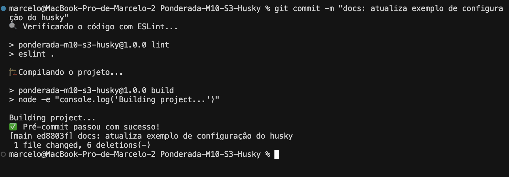
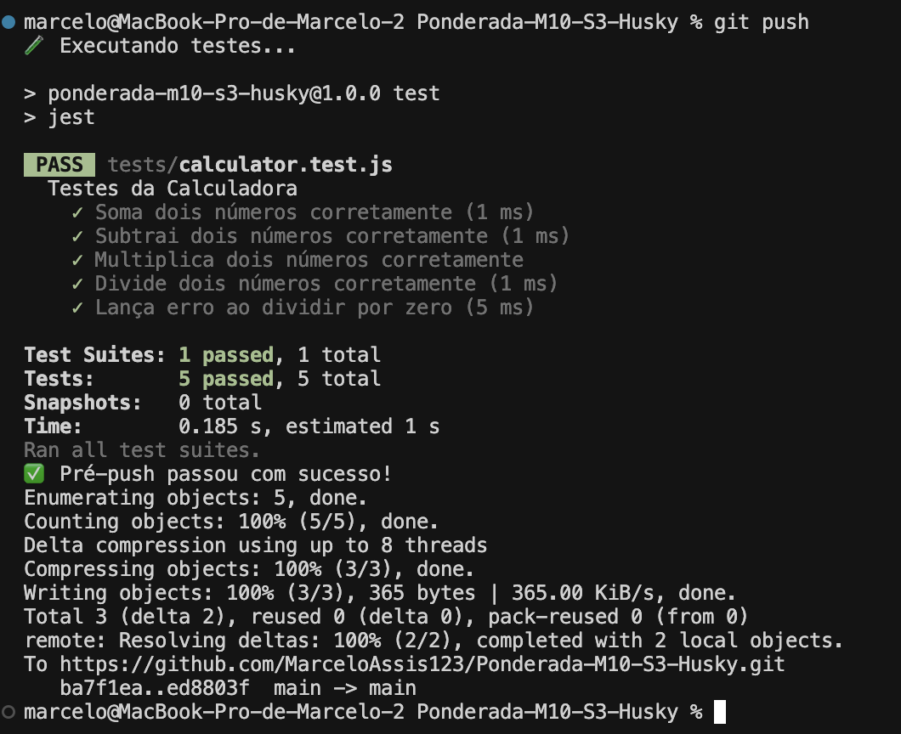

# Relatório de Configuração do Husky

Este relatório documenta o processo de configuração do Husky em um repositório GitHub para garantir a qualidade do código através de hooks de pré-commit e pré-push.

## Objetivo

Implementar hooks que garantam automaticamente:
- A compilação correta do código
- A execução bem-sucedida dos testes
- A verificação das boas práticas de codificação

## Etapas Realizadas

### 1. Inicialização do Projeto

Primeiro, inicializamos um projeto Node.js e instalamos as dependências necessárias:

```bash
# Inicializar o projeto Node.js
npm init -y

# Instalar o Husky como dependência de desenvolvimento
npm install --save-dev husky

# Instalar o ESLint para verificação de boas práticas
npm install --save-dev eslint

# Instalar o Jest para testes
npm install --save-dev jest
```

### 2. Configuração do package.json

Atualizamos o arquivo `package.json` para incluir os scripts necessários:

```json
{
  "scripts": {
    "test": "jest",
    "lint": "eslint .",
    "build": "node -e \"console.log('Building project...')\"",
    "prepare": "husky"
  }
}
```

### 3. Inicialização do Husky

Inicializamos o Husky para criar a estrutura de hooks:

```bash
npx husky init
```

### 4. Configuração do Hook de Pré-commit

Criamos um hook de pré-commit para executar o lint e a compilação:

```bash
echo "🔍 Verificando o código com ESLint..."
npm run lint || (echo "❌ Falha no lint. Por favor, corrija os erros antes de fazer commit." && exit 1)

echo "🏗️ Compilando o projeto..."
npm run build || (echo "❌ Falha na compilação. Por favor, corrija os erros antes de fazer commit." && exit 1)

echo "✅ Pré-commit passou com sucesso!"
```

### 5. Configuração do Hook de Pré-push

Criamos um hook de pré-push para executar os testes:

```bash
echo "🧪 Executando testes..."
npm test || (echo "❌ Falha nos testes. Por favor, corrija os testes antes de fazer push." && exit 1)

echo "✅ Pré-push passou com sucesso!"
```

### 6. Tornando os Hooks Executáveis

Tornamos os hooks executáveis com o comando:

```bash
chmod +x .husky/pre-commit .husky/pre-push
```

## Estrutura do Projeto

Para demonstrar o funcionamento dos hooks, criamos uma estrutura básica de projeto:

- `src/calculator.js`: Módulo de calculadora com funções básicas
- `tests/calculator.test.js`: Testes para as funções da calculadora
- `.eslintrc.json`: Configuração do ESLint
- `index.js`: Arquivo principal que usa a calculadora

## Demonstração dos Hooks

### Hook de Pré-commit

O hook de pré-commit é executado quando tentamos fazer um commit. Ele verifica:

1. Se o código está de acordo com as regras do ESLint
2. Se o projeto compila corretamente



### Hook de Pré-push

O hook de pré-push é executado quando tentamos fazer um push. Ele verifica:

1. Se todos os testes estão passando



## Conclusão

A configuração do Husky foi realizada com sucesso, garantindo que:

1. O código seja verificado quanto a boas práticas antes de cada commit
2. O projeto compile corretamente antes de cada commit
3. Todos os testes sejam executados antes de cada push

Essa configuração ajuda a manter a qualidade do código e evita que código com problemas seja integrado ao repositório central. 